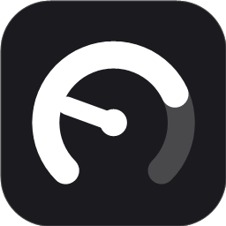
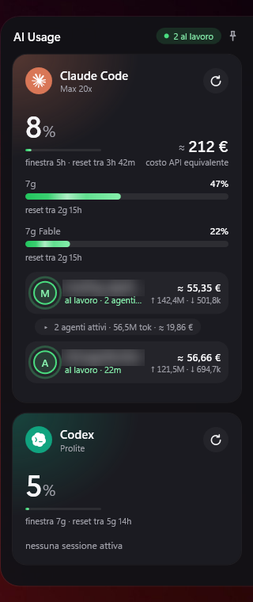
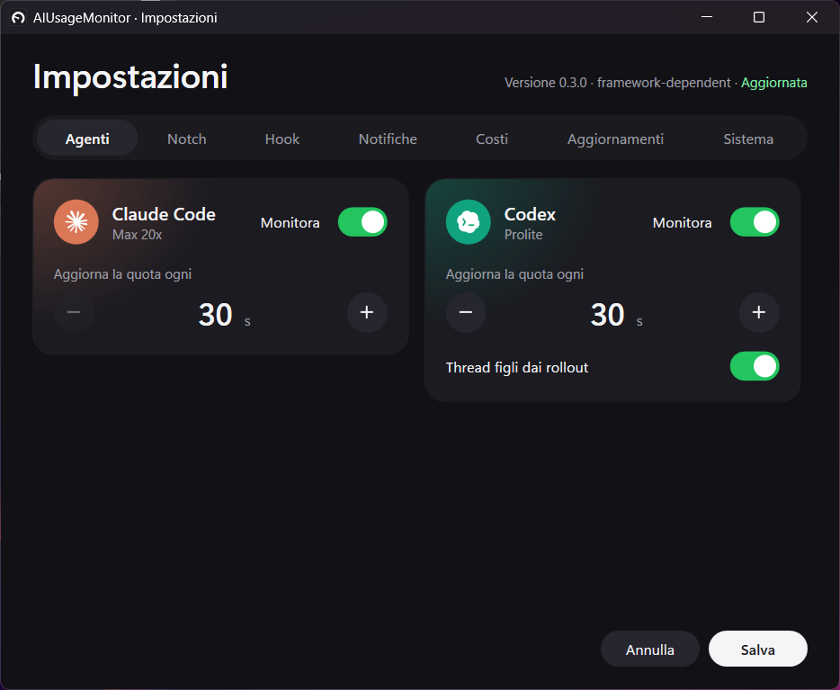
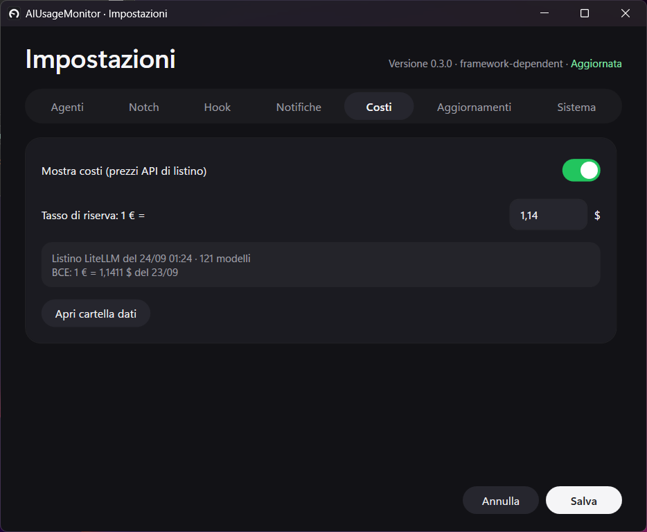
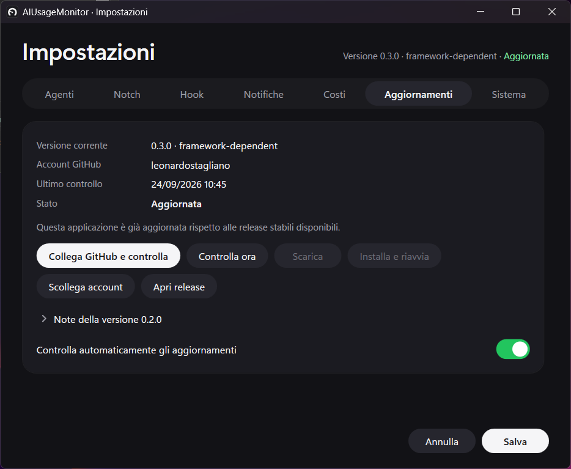
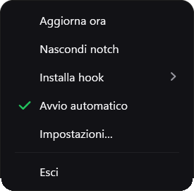

<p align="center">
  
</p>

<h1 align="center">AIUsageMonitor</h1>

<p align="center">Your Claude Code and Codex usage, live on the edge of your screen.</p>

<p align="center">
  <a href="https://github.com/leonardostagliano/AIUsageMonitor/releases/latest"></a>
  <a href="https://github.com/leonardostagliano/AIUsageMonitor/actions/workflows/windows-release.yml"></a>
  <a href="https://github.com/leonardostagliano/AIUsageMonitor/releases"></a>
  
  
  <a href="LICENSE"></a>
</p>

<p align="center">
  <a href="https://github.com/leonardostagliano/AIUsageMonitor/releases/latest"><b>Download</b></a> ·
  <a href="#features">Features</a> ·
  <a href="#how-it-works">How it works</a> ·
  <a href="#privacy">Privacy</a>
</p>

<table align="center">
  <tr>
    <td align="center" valign="top">
      
      <br><sub>The notch, pinned open</sub>
    </td>
    <td align="center" valign="top">
      
      <br><sub>Settings, one section per tab</sub>
    </td>
  </tr>
</table>

## Why

When you run Claude Code and OpenAI Codex side by side, the questions are always the same: how much of the 5-hour
window is left, which session is waiting for you, and what all those tokens would cost at API prices.
AIUsageMonitor answers them in one place that stays on screen, so you don't have to switch terminals or open a
usage page. It is inspired by [AgentBar](https://github.com/scari/AgentBar) for macOS and rebuilt from scratch for
Windows.

## Features

- **Quota at a glance.** The 5-hour and weekly windows, per-model weekly limits, extra usage and your plan, with
  severity colours and a countdown to each reset.
- **Live sessions.** Every Claude Code and Codex session shows whether it is working, waiting for your input,
  done or failed, driven by the agents' own hooks. Running workflow agents are listed under their session, with
  the model they actually use. A session whose terminal you close disappears within seconds, even though the agent
  had no chance to say goodbye.
- **Sessions outside the terminal.** Claude Code sessions started from the Claude desktop app are picked up even
  when they fire no hooks, and sessions running in the cloud (claude.ai/code, the desktop and mobile apps) and the
  runs of your routines appear next to them, tagged `app`, `cloud` or `routine`. Clicking a cloud session hands it
  to the Claude desktop app when the app is running, and opens it on claude.ai otherwise.
- **Tokens and API-equivalent cost.** Input (with cache) and output per session and per workflow agent, priced
  with the public [LiteLLM](https://github.com/BerriAI/litellm) price list and converted to euro at the ECB
  reference rate. It is labelled as an estimate: with a subscription it is not what you pay.
- **One-click refresh.** A button on each agent card refreshes its quota, tokens and costs right away, then rests
  for 10 seconds.
- **Jump to the terminal.** Click a session name to bring its terminal to the front: the exact pane in Herdr or
  wmux, otherwise the Windows Terminal or VS Code window that hosts it.
- **Notifications** when a session needs input, finishes or fails, per agent and per kind.
- **A dark, quiet interface.** The notch is a small pill on the right edge of the screen that opens on hover and
  stays open on click. Settings use one tab per section. Bars, numbers and status dots move smoothly, and all of
  it stops when Windows animations are turned off.
- **Self-updating** from this repository's GitHub releases, with SHA-256 verification and an in-place swap.

## Screenshots

<table>
  <tr>
    <td align="center" valign="top">
      
      <br><sub>Costs: price list, exchange rate and fallback rate</sub>
    </td>
    <td align="center" valign="top">
      
      <br><sub>Updates from GitHub releases</sub>
    </td>
  </tr>
  <tr>
    <td align="center" valign="top" colspan="2">
      
      <br><sub>Tray menu</sub>
    </td>
  </tr>
</table>

## Getting started

### Requirements

- Windows 10 version 2004 (build 19041) or later, or Windows 11, x64.
- The [.NET 10 Desktop Runtime](https://dotnet.microsoft.com/download/dotnet/10.0) for the regular build
  (`AIUsageMonitor-<version>-win-x64.exe`). The self-contained build
  (`AIUsageMonitor-<version>-win-x64-selfcontained.exe`, about 180 MB) needs nothing else.
- Node.js, only for live session status: the agents' hooks run a small `.cjs` script. You already have it if you
  use Claude Code or Codex.
- Git for Windows with Git Credential Manager (part of the standard installer), only to link a GitHub account for
  in-app updates.

### Install and first run

1. Download the executable from the [latest release](https://github.com/leonardostagliano/AIUsageMonitor/releases/latest).
   It is a single file with no installer.
2. Put it in a folder you can write to, for example `%LOCALAPPDATA%\Programs\AIUsageMonitor`: the updater replaces
   the file in place, which it cannot do in `Program Files`.
3. Run it. A tray icon appears and the notch sits on the right edge of the main screen. Hover to open it, click to
   keep it open.
4. Choose **Installa hook** from the tray menu (or *Settings → Hook*) to turn on live status.
5. For Codex, open Codex and run `/hooks` to approve the hook groups the app has just added.

The interface is in Italian.

## How it works

### Quota

**Claude Code.** The app reads the OAuth token in `%USERPROFILE%\.claude\.credentials.json` and calls
`GET https://api.anthropic.com/api/oauth/usage`. That gives the 5-hour window, the 7-day window, the per-model
weekly windows, extra usage and the plan name. The credentials file is only read, never written, and the token
never appears in logs or in the interface. If the token has expired or the file is missing, no call is made and
the card asks you to open Claude Code to renew the session. The quota refreshes every 60 seconds (30–600,
configurable).

**Codex.** There is no quota endpoint, so the app reads the session files
`%USERPROFILE%\.codex\sessions\YYYY\MM\DD\rollout-*.jsonl` from the end and takes the latest `token_count` records
with `rate_limits` (primary and secondary window, `used_percent`, `resets_at`, `plan_type`). Only files changed in
the last 7 days count. It refreshes when the folder changes (2-second debounce) and every 30 seconds.

The last good snapshot is cached in `%LOCALAPPDATA%\AIUsageMonitor\usage-cache.json`, so the bars are filled at
start-up and marked as not up to date until the first refresh arrives. The refresh button on a card updates that
agent's quota at once and recomputes tokens and costs for all its sessions, idle ones included; the icon spins
until it is done (15 seconds at most) and the button rests for 10 seconds. **Aggiorna ora** in the tray menu does
the same for every enabled agent.

### Live status

The agents don't expose their state, so the app reads it from their hooks.

1. **Installa hook** copies `%USERPROFILE%\.aiusagemonitor\hook.cjs` and adds the app's hook groups to
   `~/.claude/settings.json` (Claude Code) and `~/.codex/hooks.json` (Codex). Before every write it saves a backup
   in `~/.aiusagemonitor/backups/` and rewrites the JSON keeping every other key. A command that is already there
   is not added twice.
2. On every event the agent runs `node "<...>\hook.cjs" claude|codex`. The script reads stdin, appends **one JSON
   line** to `%USERPROFILE%\.aiusagemonitor\events.jsonl` and always exits with code 0, so it can neither block
   nor slow down the agent. Prompts are never recorded.
3. The app tails that file and keeps a state machine per session: `SessionStart` → ready, `UserPromptSubmit` →
   working, a `permission_prompt`/`idle_prompt` notification → waiting for input, `Stop` → done, `StopFailure` →
   error, `SessionEnd` → removed. At start-up it replays the last 24 hours silently, without toasts.
   `idle_prompt` only means the finished turn waits for the next prompt: it is ignored while the session's
   background agents or workflows are still running, and in the card's dot and the tray icon a session waiting that
   way never hides one that is working (a permission prompt still does). Granting a permission fires no hook, so
   for Claude Code the app watches the session's status in Claude Code's own registry (see below) and goes back
   to "working" as soon as the prompt is answered.
4. **Subagents.** `SubagentStart`/`SubagentStop` keep the list of running agents. On `Stop`, Claude Code (2.1 and
   later) also lists the background agents and workflows still in flight: an agent missing from that list has
   finished even if its `SubagentStop` never arrived (interrupted, killed), an agent in the list the app never saw
   start is added, and a background workflow between two phases keeps the session "al lavoro" instead of toasting
   "finito" at every phase. An agent that sends no event for 30 minutes is considered finished only if its
   transcript has not been written in that time either.
5. **Closed terminals.** Closing a terminal kills the agent before it can fire `SessionEnd`. The app ties every
   session to the process of its agent (from the process walk of the hook and from Claude Code's own session
   registry, with the process creation time so a recycled pid is never mistaken for it) and ends the session when
   that process is gone. The ties are saved in `session-processes.json`, so sessions whose terminal was closed
   while the app was not running (or before a reboot) are not brought back by the replay.

<details>
<summary>What each event line contains, and how tokens are counted</summary>

Each line holds a timestamp, the agent, the event name, `session_id`, `cwd`, the notification type and the agent's
message cut to 200 characters. `SessionStart` and `UserPromptSubmit` also carry a `host` object with a few hints
about the terminal (see [Jump to the terminal](#jump-to-the-terminal)) and Claude Code's entry point (`cli`,
`claude-desktop`...). `Stop` and `SubagentStop` carry the id, type and agent type of the background agents and
workflows still in flight.

Every session shows **↑ input** (cache included) and **↓ output** separately. They are the conversation's
cumulative tokens: the context sent again with every request is counted again, so they can be far larger than
the visible text. The tooltip splits uncached input, cache reads and cache writes. Streamed Claude responses are
de-duplicated by message id, falling back to the request id. For Codex the app adds up the growth of the
thread's cumulative total, counts restarts from zero in full (Codex resets the total when it wakes a thread for a
new task) and leaves out the history a forked subagent copies from its parent, which is already counted on the
parent. So each row's tokens are exactly the ones whose cost the row shows.

The expandable workflow list shows only agents that are **still running**, with the model read from their
transcript and their input and output tokens. Finished agents leave the list and the running summary. Until the
model or the tokens are known the row says "in attesa" (pending).

</details>

<details>
<summary>Codex: approving the hooks</summary>

Codex runs a hook group **only after you approve it**: `~/.codex/config.toml` keeps a
`[hooks.state.'<file>:<event>:<group>:<index>']` section with a `trusted_hash` for each approved group. After
**Installa hook**, open Codex and run **`/hooks`** to approve the new groups. Until the `trusted_hash` is there the
app says "(da approvare in Codex con /hooks)" and the notch shows no Codex sessions.

The app always adds its groups **at the end**, so the positional keys of groups you already approved stay valid.
The reverse is not true: removing the app's group shifts the index of groups added after it, and those need
approving again with `/hooks`. If hooks are turned off in `config.toml` (`hooks = false`) the app reports it and
leaves the file alone.

</details>

### Costs

Next to the tokens of every session and workflow agent, the notch shows the **API-equivalent cost**: what those
tokens would cost at the list prices Anthropic and OpenAI publish, converted to euro. With a subscription plan
(Max, Pro) **it is not what you pay**. Each agent card shows the total of the sessions in the notch, their agents
included; the tooltip breaks it down by model and shows the price-list date and the rate used.

<details>
<summary>How the cost is computed</summary>

- **Counting.** Tokens are split by model, by price variant (Claude fast mode, OpenAI priority and flex) and by
  context tier (prompts over 200k or 272k tokens), separating input, output, cache reads and cache writes at 5
  minutes or 1 hour. Claude Code only writes 1-hour cache, which costs 60% more. For Codex the cost follows the
  model in use at each request, even when it changes mid-thread. Claude's web searches are priced separately.
- **Price list.** The [LiteLLM](https://github.com/BerriAI/litellm) list (`model_prices_and_context_window.json`;
  every entry cites the vendor's pricing page) is downloaded at most once a day and saved in `prices-cache.json`;
  until the first download the copy built into the executable is used. A `prices-override.json` file in the same
  folder, in LiteLLM's per-model format, adds or corrects prices:

  ```json
  { "codex-auto-review": { "input_cost_per_token": 1e-7, "output_cost_per_token": 5e-7 } }
  ```

- **Exchange rate.** The ECB reference rate (dollars per euro), downloaded once a day. Offline, the last
  downloaded rate is used, then the fallback rate from the settings (default 1 € = 1.14 $).
- **Models without a price** (for example `codex-auto-review`, which no list publishes): the cost shown is a
  minimum, `≥ 1,20 €`, and the tooltip names the missing model. If no model has a price, or the priced part stays
  under a cent, the notch shows `costo n/d`.

In *Settings → Costi* you can hide costs, which also stops every price-list and rate download, and set the
fallback rate.

</details>

### Jump to the terminal

Click a session name in the notch (the pointer turns into a hand) and the app brings the terminal hosting that
Claude Code or Codex session to the front, without unpinning the notch.

1. On `SessionStart` and `UserPromptSubmit` the hook records a `host` object from its own environment:
   `HERDR_PANE_ID`, `WMUX_PTY_ID`, `WT_SESSION`, `TERM_PROGRAM`, `VSCODE_PID` and its parent pid. Sessions started
   before this version get it with their next prompt.
2. When the event arrives the app walks up the process tree from that parent pid and keeps, per session, the
   agent's pid and the first ancestor that owns a top-level window.
3. On click it tries, in order: **Herdr** (`herdr agent focus <pane>`, with `herdr tab focus` as a fallback),
   **wmux** (the workspace, pane and tab of the pty, then the wmux window), the window found in step 2, and
   finally the `VSCODE_PID` and `WT_SESSION` hints. If nothing works, a "Terminale non trovato" toast appears.

<details>
<summary>What each strategy can and cannot do</summary>

**Herdr** and **wmux** reach the pane itself, even in another tab or workspace. wmux runs its shells under a
daemon without a window, and the process that ran the hook has already exited when the event arrives, so the
process walk rarely works there: the `WMUX_PTY_ID` recorded by the hook leads to the pane. The app talks to wmux
on its control named pipe with the token in `%USERPROFILE%\.wmux-auth-token`, like the `wmux` CLI does.

**Without a multiplexer** the app activates the window found by walking the processes when the event arrived.
That is the right window even with several Windows Terminal windows open, because it depends on the ancestor of
the hook's process, not on how many windows there are. It cannot pick the tab, since activation works on the
top-level window: with several tabs in one window you get the right window with whichever tab was active. In
**VS Code**, if the walk finds no window, the app falls back to `VSCODE_PID`; all VS Code windows belong to one
process, so with several windows open a different one may come to the front. The one case where the app gives up
is the `WT_SESSION` fallback with several Windows Terminal windows open, because `WT_SESSION` does not say which
one it is.

Herdr calls and process walks never block the interface: they run on background threads with a 3-second timeout.
To test without the notch, `AIUsageMonitor.exe --focus-session <sessionId>` waits for the initial replay, tries
to focus that session's terminal and writes the outcome to the log.

If the hooks are already installed you don't need to reinstall them for new versions: at every start the app
aligns `hook.cjs` with the copy built into the executable, rewriting it only when the content changed. If the
file is locked, the app starts anyway, logs the error, keeps the old script and tries again next time.

</details>

### Updates

Every push to `main` publishes a release of this repository (see [Releases](#releases)); the app finds it,
downloads it and replaces itself.

1. **Link.** *Settings → Aggiornamenti → Collega GitHub e controlla* starts Git Credential Manager in browser
   mode: GitHub asks you to pick an account and, the first time, to authorise Git Credential Manager. Each link
   uses a fresh GCM namespace, so it neither reuses nor changes the accounts saved in Windows Credential Manager.
   The session is encrypted with DPAPI (current Windows user) in `%LOCALAPPDATA%\AIUsageMonitor\updates-auth.json`
   and is the **only** credential used: never a PAT, a GitHub Desktop account or git's credential helper.
   **Scollega account** deletes it.
2. **Check.** With an account linked and automatic checks on (the default), the app checks 15 seconds after start
   and then every 6 hours; **Controlla ora** checks at once. It reads the 100 most recent releases and picks the
   highest stable SemVer version (not the "Latest" label) that ships the executable of the **same variant** you
   are running (framework-dependent or self-contained).
3. **Offer.** A new version brings a Windows notification (once per version) and an **Aggiorna alla versione X…**
   item at the top of the tray menu. Both open a confirmation that downloads and restarts with one consent;
   **Più tardi** skips that version until the app restarts. In the settings the steps are separate (**Scarica**,
   **Installa e riavvia**) and **Apri release** opens the GitHub page with the notes.

<details>
<summary>How the download is verified and the executable swapped</summary>

Before downloading, the app reads the chosen release again, to notice an asset replaced in the meantime. The only
allowed addresses are the repository API, its release downloads and GitHub's asset CDNs; redirects are followed
one at a time and checked again, and the token only goes to `api.github.com`. The SHA-256 of the downloaded file
must match the release's `SHA256SUMS.txt` and the digest published by GitHub (when both exist they must also
match each other); the file must be a Windows executable whose embedded version is the release's version.

The executable is a single file with no installer. The app verifies it again, renames the running exe to
`AIUsageMonitor.exe.old-<id>` (Windows lets you rename a running exe, not overwrite it), puts the new version
**at the same path**, starts it with `--updated <pid>` and exits. The new instance waits for the old one to exit
before taking the single-instance mutex and shows an "AIUsageMonitor aggiornato" notification. Autostart, taskbar
pins and notifications keep working because the path does not change; settings, hooks and caches are untouched.
If a step fails, the previous exe goes back in place. If you quit the app while the swap is running, it waits for
it to finish and does not reopen: the new version starts next time. The `.old-*` files are deleted at the next
start.

In-app installation needs a folder you can write to: from a protected folder (for example `Program Files`) or
from `dotnet run` the app still reports the new version, but you download it from the release page and replace
it by hand. The write test (a temporary file next to the exe) only runs when there is a version to install or
when you download or install, never at start-up; with Windows *Controlled folder access* on and the exe on the
Desktop or in Documents, Windows Security may flag it at those moments. `AIUsageMonitor.exe --updates` opens the
settings on the updates tab.

</details>

### Sessions outside the terminal

**Claude desktop app.** Every Claude Code process — the CLI, `claude -p`, and the SDK the desktop app runs — keeps
a record in `%USERPROFILE%\.claude\sessions\<pid>.json` with its session id, folder, entry point and status
(`busy`, `waiting`, `idle`). The app reads those records every 3 seconds. A session that no hook has reported after
8 seconds (typically a desktop app session, or any session while the hooks are not installed) is adopted from its
record and follows its status: busy → working, waiting → waiting for input, back to idle → done. Sessions started
from the desktop app are tagged `app`, and clicking them brings the app window to the front. Their tokens and costs
come from their transcript, like any other session. Sessions reported by the hooks are left to the hooks. The
desktop app keeps a conversation's process open long after it is over, so a finished `app` session leaves the notch
10 minutes after its last turn and comes back as soon as it works again; processes started ahead of time and not
yet used by any conversation are ignored.

**Cloud sessions and routines.** With *Settings → Agenti → Sessioni cloud e routine* on (the default), the app also
reads, at the same pace as the Claude quota, the Claude Code sessions of your account that run in Anthropic's cloud
(`GET /v1/code/sessions`, the list `claude --teleport` shows) and the latest run of each routine
(`GET /v1/code/triggers`), with the OAuth token Claude Code already keeps on your machine. A cloud session is shown
while it works or waits for you, and for 10 minutes after it finishes; it shows the tokens and API-equivalent
cost the session reports about itself. Clicking its name hands it to the Claude desktop app when the app is already
running, even with its window hidden, through a `claude://claude.ai/epitaxy/session_<id>` link, the path the app uses
for Code sessions. That path is not documented, so another version of the app may ignore it or show its home screen.
The click counts as opened in the app only when the app visibly reacts within 3 seconds (one of its windows comes
to the front, shows up or changes title); otherwise, and whenever the app is not running, the session
opens on claude.ai in your browser. The app is never started just to open a session. Remote Control sessions are
skipped: they are local sessions the hooks already report. The first read after start-up raises no notifications.

## Privacy

- **Read locally only:** Claude credentials, Codex session files, the hook configuration, the event file, Claude
  Code's session registry (`~/.claude/sessions`) and the organization id in `~/.claude.json`.
- **Network:** the Anthropic usage endpoint, with the OAuth token already on your machine. With cloud sessions on
  (the default), also the sessions and routines endpoints of the same API, with the same token: they return titles,
  statuses and token counts, which stay in memory and are never logged. With costs on (the
  default), also two anonymous requests at most once a day that send no data: the LiteLLM price list from
  `raw.githubusercontent.com` and the reference rate from `www.ecb.europa.eu`. The updater talks to GitHub only
  after you link an account: this repository's release API and its asset downloads, with the session the app
  created (never logged or shown).
- **Never sent, logged or shown:** prompts, conversation content and tokens. Recorded events hold event names,
  the session id, the working folder, a short message from the agent and, on start and prompt events, a few hints
  about the hosting terminal (parent pid, Herdr pane, wmux pty, `WT_SESSION`, `TERM_PROGRAM`, `VSCODE_PID`,
  Claude Code's entry point), used only by the jump-to-terminal click, and on stop events the ids of the background
  agents still running. They never leave the machine.
- **No telemetry.**

## Files

| Path | Contents |
|---|---|
| `%LOCALAPPDATA%\AIUsageMonitor\settings.json` | app settings |
| `%LOCALAPPDATA%\AIUsageMonitor\usage-cache.json` | last quota snapshot per agent |
| `%LOCALAPPDATA%\AIUsageMonitor\prices-cache.json` | downloaded LiteLLM price list (Anthropic and OpenAI models only) |
| `%LOCALAPPDATA%\AIUsageMonitor\prices-override.json` | prices you add or correct (optional) |
| `%LOCALAPPDATA%\AIUsageMonitor\exchange-rate.json` | last ECB reference rate |
| `%LOCALAPPDATA%\AIUsageMonitor\logs\app-<date>.log` | logs (7 days, Info level) |
| `%LOCALAPPDATA%\AIUsageMonitor\session-processes.json` | which process runs each session, and the sessions found ended, to drop closed terminals |
| `%LOCALAPPDATA%\AIUsageMonitor\updates-auth.json` | the updater's GitHub session, DPAPI-encrypted |
| `%LOCALAPPDATA%\AIUsageMonitor\updates\` | downloaded version waiting to be installed (stale files or files older than 7 days are deleted) |
| `<exe folder>\AIUsageMonitor.exe.old-<id>` | previous version after an update, deleted at the next start |
| `%USERPROFILE%\.aiusagemonitor\hook.cjs` | installed hook script |
| `%USERPROFILE%\.aiusagemonitor\events.jsonl` | agent events (rotated at 5 MB) |
| `%USERPROFILE%\.aiusagemonitor\backups\` | backups of the configuration files before every change |

The settings cover: enabled agents and refresh intervals, cloud sessions and routines, the notch's monitor, vertical offset, close delay and
compact mode, which notifications to show and for which agents, automatic update checks, costs (show or hide,
fallback rate) and autostart (the `AIUsageMonitor` value in `HKCU\Software\Microsoft\Windows\CurrentVersion\Run`).

## Build from source

You need the .NET 10 SDK.

```powershell
dotnet build AIUsageMonitor.slnx
dotnet test AIUsageMonitor.slnx
node --test tests/hook/hook.test.cjs scripts/windows-release.test.mjs   # hook script and release tests
dotnet run --project src/AIUsageMonitor.App

pwsh scripts/publish.ps1                                     # -> publish/AIUsageMonitor.exe (needs the .NET 10 Desktop Runtime)
pwsh scripts/publish.ps1 -SelfContained -Output publish-sc   # self-contained executable (~180 MB)
pwsh scripts/publish.ps1 -Version 0.2.0                      # same build with the given version, as CI does

dotnet run --project tools/MakeIcon                          # regenerates src/AIUsageMonitor.App/Assets/app.ico
dotnet run --project src/AIUsageMonitor.Probe -- --update-price-snapshot   # regenerates the built-in price list
```

For the framework-dependent build the script uses `--no-self-contained`: with the .NET 10 SDK and
`PublishSingleFile`, `--self-contained false` still produces a self-contained executable.

The app is single-instance (mutex `Local\AIUsageMonitor`): starting it again pins the running instance's notch
open instead of opening a second one. A few switches help when checking the interface: `--settings` opens the
settings window, `--tray-menu` opens the tray menu in the middle of the main screen, and `--test-notification`
(with the app closed) sends a test notification.

### Releases

Local builds publish nothing. `.github/workflows/windows-release.yml` runs on every push to `main` (and by hand
with *Run workflow*) on a Windows runner:

1. `node scripts/windows-release.mjs prepare` works out the version: it starts from the last published release
   (or from `<Version>` in `src/AIUsageMonitor.App/AIUsageMonitor.App.csproj` if that is higher) and bumps it
   according to the conventional commits since then: `feat:` → minor, `!` or `BREAKING CHANGE:` → major,
   everything else → patch. A commit already contained in a release does not create another one.
2. .NET and Node tests, then `dotnet publish -p:Version=<version>` of the two single-file win-x64 variants and a
   smoke test that checks the header, the embedded version and the variant.
3. `node scripts/windows-release.mjs publish` creates the `v<version>` release as a draft with
   `AIUsageMonitor-<version>-win-x64.exe`, `AIUsageMonitor-<version>-win-x64-selfcontained.exe` and
   `SHA256SUMS.txt`, verifies the uploads and only then publishes it as *Latest*.

The version lives in tags and releases: the workflow never commits or pushes to the repository.

## Known limitations

- **Cloud sessions:** the sessions and routines endpoints are the internal ones the Claude Code CLI uses, not a
  documented API: if they change, the log says "Sessioni cloud: ..." and the rest of the app keeps working. Cowork
  sessions are not listed, and cloud sessions have no subagent list.
- **Desktop app sessions without hooks:** their status comes from Claude Code's session registry, so they show
  "waiting for input" and "done" but no agent list and no message.

- **Claude Code, permissions:** granting a permission fires no hook. With Claude Code 2.1 and later the app sees
  the answer in Claude Code's session registry within about 3 seconds; with older versions the session stays
  "waiting for input" until the next `Stop`, that is until the end of the turn. `AskUserQuestion` is the
  exception: its `PostToolUse` puts the session back to "working" at once.
- **Codex, waiting for input:** Codex exposes `PermissionRequest`, but the app does not register it, to stay out
  of the approval flow. Codex sessions therefore never show "waiting for input": they go from "working" to "done".
- Live status depends on the hooks: without them (and, for Codex, without approval through `/hooks`) the cards
  say "Stato live non attivo: installa hook".
- Codex quotas only update when a Codex session writes a new `token_count`.

## Credits and license

Inspired by [AgentBar](https://github.com/scari/AgentBar) (macOS). Agent icons from
[lobe-icons](https://github.com/lobehub/lobe-icons); price data from [LiteLLM](https://github.com/BerriAI/litellm).
Details in [THIRD-PARTY-NOTICES.md](THIRD-PARTY-NOTICES.md).

MIT — see [LICENSE](LICENSE).
